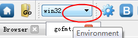

<!-- Feature Guide -->

# LiteIDE Feature Guide

## Environments
The LiteIDE environment setup plugin allows you to quickly switch between multiple system environments for your build.  Each environment has its own set of environment variables that can be used to control the build process.

### Selecting an Environment
The dropdown in the toolbar can be used to select the environment currently being used for builds.  By default, the `system` environment, representing the platform and architecture of the host machine, is used.

The following environments are provided as part of the supported platforms:
* Windows - system win64 win32
* Linux - system linux64 linux32
* MacOSX - system darwin64 darwin32

See the section below on cross-compiling before switching to a non-native environment.

### Configuring an Environment
The variables defined as part of the environments can be modified by hand.  To edit an environment, simply click the `Edit Environment` button next to the environment dropdown when the desired environment has been selected.

Alternatively, environments can be viewed and edited in the `View > Options > LiteEnv` panel.

Example `win32.env`:

    #win32 environment
    
    GOROOT=c:\go
    #GOBIN=
    GOARCH=386
    GOOS=windows
    
    PATH=c:\mingw32\bin;%GOROOT%\bin;%PATH%
    
    LITEIDE_GDB=gdb
    LITEIDE_MAKE=mingw32-make
    LITEIDE_TERM=%COMSPEC%
    LITEIDE_TERMARGS=
    LITEIDE_EXEC=%COMSPEC%
    LITEIDE_EXECOPT=/C

Example `linux32.env`:

    #linux32 environment
    
    GOROOT=$HOME/go
    #GOBIN=
    GOARCH=386
    GOOS=linux
    
    PATH=$GOROOT/bin:$PATH
    
    LITEIDE_GDB=gdb
    LITEIDE_MAKE=make
    LITEIDE_TERM=/usr/bin/gnome-terminal
    LITEIDE_TERMARGS=
    LITEIDE_EXEC=/usr/bin/xterm
    LITEIDE_EXECOPT=-e

## Cross-compilation
You will need to build or install Go compilers for other platforms and architectures before cross-compiling.  If you do not do this, you may receive errors about missing executables or even the following error:

    %GOROOT%/src/pkg/runtime/extern.go:137: undefined: theGoos

See the "Building compilers" subsection for examples.

### Environment variables
To cross-compile your project for another operating system or architecture, you will need to define the following variables in your environment:

* `$GOOS` - the name of the target operating system (default: `$GOHOSTOS`).  Possible values are:
    * darwin (Mac OS X 10.6 and above)
    * freebsd
    * linux
    * netbsd
    * openbsd
    * plan9
    * windows
* `$GOARCH` - the name of the target architecture (default: `$GOHOSTARCH`).  Possible values are:
    * amd64 (64-bit x86, the most mature port)
    * 386 (32-bit x86)
    * arm (32-bit ARM)
* `$GOARM` - ARM architecture version the run-time libraries should target (default: 6).
    * Setting `$GOARM` to 5 causes the linker to emit calls to a software floating point implementation instead of using hardware floating point support. 
* `$CGO_ENABLED`
    * This should be set to 0 when cross-compiling.

### Building Compilers
To build the compilers for cross-compilation, run the appropriate script from the Go sources directory.  The examples below demonstrate how to build some common compilers; you must modify the environment variables appropriately.

Building cross-compiler for 64-bit Linux on Windows (in MinGW with GCC):

    > set GOARCH=amd64
    > set GOOS=linux
    > set CGO_ENABLED=0
    > cd %GOROOT%\src
    > all.bat

Building cross-compiler for 32-bit Windows on Linux:

    > export GOARCH=386
    > export GOOS=windows
    > export CGO_ENABLED=0
    > cd $GOROOT/src
    > ./all.bash

Building cross-compiler for Linux ARM on Mac OS X:

    > export GOARCH=arm
    > export GOOS=linux
    > export CGO_ENABLED=0
    > cd $GOROOT/src
    > ./all.bash

### Building
To actually perform a cross-compilation in LiteIDE, begin by selecting the appropriate environment as described above.  Ensure that the environment has the correct variables set.  `GOARCH`, `GOOS`, `GOARM`, and `CGO_ENABLED` must be set as outlined previously.  Ensure that `GOROOT` and `GOBIN` are also properly defined for your host platform, and that your `PATH` includes the Go binary and Go's `bin` directory.

Once the target environment has been selected, simply rebuild your project in the editor.

Example configuration for cross-compiling 64-bit Linux binaries on Windows:

    GOROOT=c:\go
    GOBIN=
    GOARCH=amd64
    GOOS=linux
    CGO_ENABLED=0
    
    PATH=%GOBIN%;%GOROOT%\bin;%PATH%
    ...
	
## Golang Code Format	
Automatic formatting when saving.

### Goimports
LiteIDE View->Options->GolangFmt-> Use goimports instead of gofmt, for code format

This tool updates your Go import lines, adding missing ones and
removing unreferenced ones.

## Gocode
Code completion use gocode <https://github.com/nsf/gocode>.gocode works .a file is read from the project dependencies, so please update project libraries can not rely on code completion.

### update depends packages
update depends packages for gocode, click build menu or toolbar `Get`(go get)

### auto update depends packages
LiteIDE View->Options->Gocode-> auto update depends packages

## Build System
LiteIDE's build system is highly configurable, allowing you to define your own custom build actions using XML files.

### Configuring Build Actions
To modify the available build options, open `View > Options > LiteBuild`.  You can add your own images in this directory to define new icons.  Any XML files in this directory are read to load action buttons.  Double click on an XML file to edit it.  Each XML file defines all of the build actions for one particular type of file.

Example XML for Go (`gosrc.xml`):

	<?xml version="1.0" encoding="UTF-8"?>
	<mime-info xmlns='http://www.freedesktop.org/standards/shared-mime-info'>
		<mime-type type="text/x-gosrc" id="gosrc" work="$(EDITOR_DIR)" ver="1">
			<config id="Go" name="GO" value="go"/>
			<config id="GoExec" name="GOEXEC" value="$(LITEAPPDIR)/goexec"/>
			<config id="ErrRegex" name="ERRREGEX" value="(\w?:?[\w\d_\-\\/\.]+):(\d+):"/>
			<custom id="TargetArgs" name="TARGETARGS" value=""/>
			<custom id="BuildArgs" name="BUILDARGS" value=""/>
			<custom id="InstallArgs" name="INSTALLARGS" value=""/>
			<action id="Build" img="blue/build.png" key="Ctrl+B;F7" cmd="$(GO)" args="build $(BUILDARGS)" save="all" output="true" codec="" regex="$(ERRREGEX)" navigate="true"/>
			<action id="Install" menu="Build" img="blue/install.png" key="Ctrl+F8" cmd="$(GO)" args="install $(INSTALLARGS)" save="all" output="true" regex="$(ERRREGEX)" navigate="true"/>
			<action id="BuildTests" menu="Build" img="blue/buildtest.png" cmd="$(GO)" args="test -c -gcflags &quot;-N -l&quot;" save="all" output="true" codec="" regex="$(ERRREGEX)"/>
			<action id="Clean" menu="Build" img="blue/clean.png" cmd="$(GO)" args="clean" save="all" output="true"/>
			<action id="CleanAll" menu="Build" img="blue/cleanall.png" cmd="$(GO)" args="clean -i" save="all" output="true"/>
			<action id="BuildAndRun" img="blue/buildrun.png" key="Ctrl+R;Ctrl+F7" task="Build;Run" killold="true"/>
			<action id="Run" menu="BuildAndRun" img="blue/run.png" key="Ctrl+F5" cmd="$(EDITOR_DIRNAME_GO)" args="$(TARGETARGS)" output="true" codec="utf-8" readline="true"/>
			<action id="RunTerm" menu="BuildAndRun" img="blue/runterm.png" key="Ctrl+Shift+F5" cmd="$(LITEIDE_EXEC)" args="$(LITEIDE_EXECOPT) $(GOEXEC) $(EDITOR_DIRNAME_GO) $(TARGETARGS)" output="false" readline="true"/>
			<action id="FileRun" menu="BuildAndRun" img="gray/filerun.png" key="Alt+F6" cmd="$(GO)" args="run $(EDITOR_NAME)" save="editor" output="true" codec="utf-8" readline="true"/>
			<action id="Test" img="blue/test.png" key = "Ctrl+T" cmd="$(GO)" args="test" save="all" output="true" codec="utf-8" regex="$(ERRREGEX)" navigate="true"/>
			<action id="Bench" menu="Test" img="blue/testbench.png" cmd="$(GO)" args="test -test.bench=.*" save="all" output="true" codec="utf-8" regex="$(ERRREGEX)" navigate="true"/>
			<action id="Get" menu="Test" img="blue/get.png" cmd="$(GO)" args="get -v ." save="all" output="true" codec="utf-8"/>
			<action id="Fmt" menu="Test" img="blue/fmt.png" cmd="$(GO)" args="fmt" save="all" output="true" regex="$(ERRREGEX)" navigate="true"/>
			<action id="Vet" menu="Test" img="blue/vet.png" cmd="$(GO)" args="vet" save="all" output="true" regex="$(ERRREGEX)" navigate="true"/>
			<target id="Target" cmd="$(EDITOR_DIRNAME_GO)" args="$(TARGETARGS)" work="$(EDITOR_DIR)"/>
		</mime-type>
	</mime-info>

## Gocode
Gocode is required for auto-completion of identifiers.  See `INSTALL` for installation details.

## Godoc Viewer
LiteIDE includes an integrated viewer for godoc output.  Documentation can be viewed for the Go language itself or for your own packages.  Open the viewer using `View > Godoc Viewer` for more details.

## Search and replace
The editor provides search and replace functionality in the `Find` menu.  Regular expressions are supported.  For example:

    Find: (Colo)(u)(r)
    Replace: \1\3

The above example will replace all instances of `Colour` with `Color`.

Search functionality is also provided for the filesystem through `Find > File Search`.

## Debugging
To debug your code with LiteIDE, you must have GDB installed (part of MinGW for Windows users).  See `INSTALL` for installation details.

The environment variable `LITEIDE_GDB` can be used to control which binary is executed for debugging.  32-bit Windows will use `gdb.exe`, while 64-bit Windows will use `gdb64.exe`.  Configure this environment variable in your environment file.

## Keybord Mapping Scheme
You can modify the shortcut keys used for all of LiteIDE's features.  Open `View > Options > LiteApp > Keyboard` to modify the hotkeys.  Double click on the shortcut in the list to edit it, and press `Apply` to apply the changes.

Shortcut keys must follow a specific format.  You can separate items using a comma (`,`) to form an AND relationship (i.e. both shortcuts must be pressed to activate the item).  Separate items with a semicolon (`;`) to form an OR relationship (i.e. any of the shortcuts will activate the item).  This is normally what you want.

Examples:
* `Ctrl+B`
* `Ctrl+Shift+B`
* `Ctrl+K,Ctrl+U`
* `Ctrl+Y;Ctrl+Shift+Z`